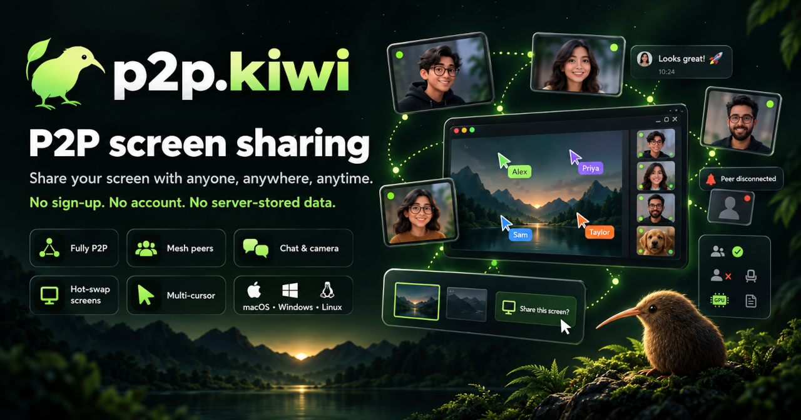

<div align="center">


# `p2p.kiwi` - P2P Conferencing and Screen Sharing

[](https://p2p.kiwi/)
[](https://the-dont-be-evil-company.com/discord)
[](https://github.com/dont-be-evil-company/p2p.kiwi/releases/latest)

[Install](#install) •
[Website](https://p2p.kiwi/) •
[Privacy Policy](./PRIVACY.md) •
[Terms of Service](./TOS.md) •
[Code of Conduct](./CODE_OF_CONDUCT.md)

<p></p>

`p2p.kiwi` P2P Conferencing and Screen Sharing is a simple and
easy-to-use screen sharing tool for Mac, Windows, and Linux.

It utilizes a peer-to-peer connection to share your screen with others,
without the need for an account. STUN and optional TURN servers are still
used to exchange ICE connectivity information.

That is not a signaling server for chat or media keys.



</div>

## Install

## Install Manually

Grab the latest release from the [GitHub releases page](https://github.com/dont-be-evil-company/p2p.kiwi/releases/latest).

## Install via Arch Linux `AUR`

```sh
paru -S p2p-kiwi-bin`
```

or

```sh
yay -S p2p-kiwi-bin`
```

## Install via Homebrew

```sh
brew install --cask p2p-kiwi
```

## `E2EE` (End-to-End Encryption) 

> [!WARNING]
> Don't determine whether the call is `E2EE` by checking whether WebRTC reports `DTLS-SRTP`.
> `DTLS-SRTP` is expected to encrypt transport.
>
> Our actual `E2EE` guarantee comes from [`MLS`-managed application keys](https://www.rfc-editor.org/rfc/rfc9420.html) encrypting the media with [`SFrame`](https://www.rfc-editor.org/rfc/rfc9605.html).

### `E2EE` (End-to-End Encryption) Architecture

```
┌─────────────────────────────────────────────┐
│                  MLS                        │
│       membership + E2EE key management      │
├─────────────────────────────────────────────┤
│                 SFrame                      │
│       E2EE encryption of media frames       │
├─────────────────────────────────────────────┤
│               DTLS-SRTP                     │
│          WebRTC transport security          │
├─────────────────────────────────────────────┤
│               ICE / UDP                     │
│               networking                    │
└─────────────────────────────────────────────┘
```

**`MLS` answers:**
"Who is in this encrypted group, and what cryptographic secrets should they possess?"

**`SFrame` answers:**
"How do I encrypt this video/audio frame so infrastructure carrying it can't read it?"

**`DTLS-SRTP`** answers:
"How do I securely transport WebRTC media over this connection?"

### `E2EE` (End-to-End Encryption) Example

```
     MLS Group
┌─────────────────┐
│ Alice Bob Carol │
└────────┬────────┘
         │
 derives E2EE keys
         │
         ▼
      SFrame
   encrypt media
         │
         ▼
     DTLS-SRTP
         │
 WebRTC transport
         │
         ▼
        Peer
```
